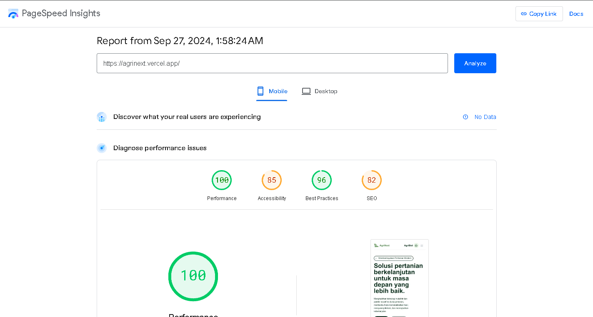

1. Ringkasan Project
   - Nama Project: Agrinext
   - Deskripsi: Aplikasi web statis yang berfokus pada penyediaan solusi dan layanan pertanian inovatif.
   - Teknologi yang Digunakan: Next.js14, TypeScript, Tailwind CSS
   - Link Live Website: https://agrinext.vercel.app/

2. Struktur Folder
   /app
   ├── /page.tsx # Titik masuk utama aplikasi
   ├── /components
   │ ├── Hero.tsx # Hero section component
   │ ├── Solutions.tsx # Solutions section component
   │ ├── Blogs.tsx # Blogs section component
   │ ├── Services.tsx # Services section component
   │ ├── Faq.tsx # FAQ section component
   │ └── Footer.tsx # Footer component
   ├── /blogs
   │ └── [label]
   │ └──── page.tsx# Halaman untuk menampilkan satu postingan blog
   │ └── page.tsx # Halaman untuk menampilkan semua postingan blog
   └── /agribot
   └── page.tsx # Halaman chatbot
   └── /kontak-kami
   └── page.tsx # Halaman Kontak Kami

4. Deskripsi Component
   3.1 Hero Component

   - File: src/app/components/Hero.tsx
   - Deskripsi: Menampilkan bagian pengantar dengan tagline yang menarik dan tombol ajakan bertindak.
     3.2 Solutions Component
   - File: src/app/components/Solutions.tsx
   - Deksripsi: Daftar solusi inovatif yang ditawarkan oleh AgriNext dengan elemen interaktif.
     3.3 Blogs Component
   - File: src/app/components/Blogs.tsx
   - Deskripsi: Menampilkan daftar blog terkait inovasi pertanian.
     3.4 Services Component
   - File: src/app/components/Services.tsx
   - Deskripsi: Menyoroti berbagai layanan yang disediakan oleh AgriNext.
     3.5 Faq Component
   - File: src/app/components/Faq.tsx
   - Deskripsi: Berisi pertanyaan umum dengan jawaban yang dapat diperluas.
     3.6 Footer Component
   - File: src/app/components/Footer.tsx
   - Deskripsi: Berisi informasi kontak dan tautan media sosial.

5. Routing

- Main Page: /src/app/page.tsx - Entry point untuk aplikasi AgriNext.
- Blog Page:src/app/blogs/page.tsx - Menampilkan semua postingan blog.
- Single Blog Page:src/app/blogs/[label]/page.tsx - Menampilkan postingan blog individual secara dinamis berdasarkan label.
- Chatbot Page: src/app/agribot/page.tsx - Halaman khusus untuk chatbot AgriBot.
- Kontak Kami Page: src/app/kontak-kami/page.tsx - Halaman kontak kami

5. Installation & Setup

- Clone Repository
  git clone https://github.com/syahrulj6/agrinext.git

- Ubah direktori ke folder proyek
  cd agrinext

- Install dependencies
  npm install

- Run Development
  npm run dev

Google LightHouse

